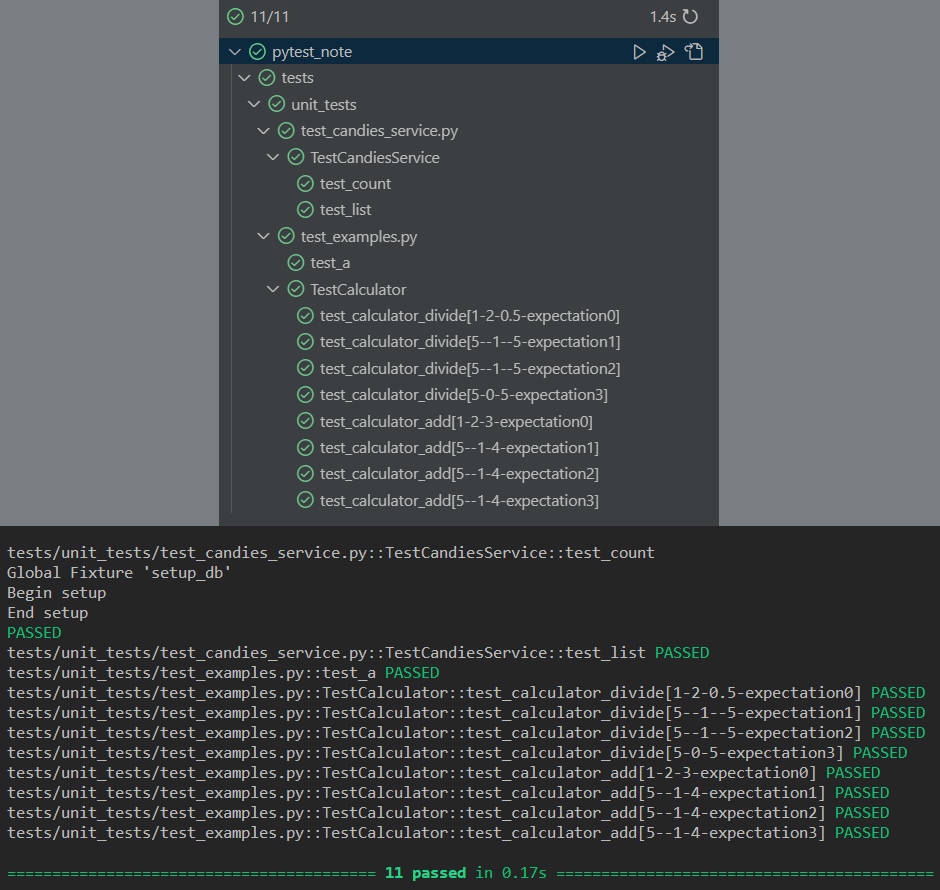

# Описание
> **Проект является обучающим материалом и содержит заметки по базовому функционалу Pytest.**
> 
> **Также в проекте присутствуют заметки по SQLAlchemy и Pydantic, с помощью которых реализован код для тестирования.**

## Структура пройденных тестов

## Замена .env файла для тестов
При тестировании файл `.dev.env` заменяется на `.test.env`, в котором находятся настройки тестовой БД

Замена производится с помощью библиотеки `pytest-dotenv`

Для этого достаточно добавить в `pyproject.toml`:
> `[tool.pytest.ini_options]`
>  
> `env_files = [".test.env",]`
> 
 

